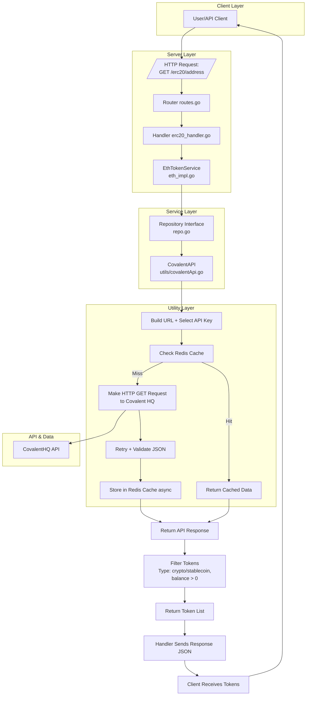

# Notes-From-Work
# ✅ ERC-20 Token Fetching API – Architecture Overview

This Go-based module fetches and returns normalized ERC-20 token balances for a given Ethereum address, using the CovalentHQ API with built-in caching, retry logic, and a clean layered architecture.

---

## 📁 1. Layered Architecture

| Layer           | Responsibility                                     | Files Involved                              |
|----------------|-----------------------------------------------------|---------------------------------------------|
| **Handler**     | HTTP request handling, validation, API response     | `server/erc20_handler.go`                   |
| **Service**     | Business logic for token fetch                      | `pkg/tokenAsset/eth_impl.go`, `repo.go`     |
| **Factory**     | Data models / structs                               | `pkg/factory/tokenAssets.go`                |
| **Utility**     | External API calls + Redis cache abstraction        | `utils/covalentApi.go`                      |
| **Routing**     | Route registration & CORS setup                     | `server/routes.go`                          |
| **Configuration** | API keys, base URLs, env config                  | `vayu-config-dev.json`, `viper`             |
| **Server Init** | DI and service setup                                | `server/server.go`                          |

---

## 🧩 2. Core Components & Their Roles

### 🔹 `utils/covalentApi.go`
- Interacts with CovalentHQ API
- Load balances between multiple API keys
- Caches responses via Redis
- Implements retry & JSON schema validation

### 🔹 `pkg/tokenAsset/eth_impl.go`
- Implements `Repository` interface
- Calls utility layer to fetch tokens
- Filters: only non-zero `cryptocurrency` & `stablecoin` tokens
- Returns `[]TokenItem` for client use

### 🔹 `pkg/tokenAsset/repo.go`
- Interface defining token-fetching contracts
- Allows swapping Covalent with other providers (Alchemy, Moralis, etc.)

### 🔹 `pkg/factory/tokenAssets.go`
- Structs:
  - `TokenItem`: normalized ERC-20 token
  - `ERC20QueryParams`: parameters from handler to service

### 🔹 `server/erc20_handler.go`
- Parses `GET /erc20/{address}`
- Validates address format
- Calls service and returns final response

### 🔹 `server/routes.go`
- Maps `/erc20/{address}` to handler
- Enables CORS support via middleware

### 🔹 `server/server.go`
- Initializes Covalent utility & service
- Injects dependencies into HTTP server

---

## 🔄 3. Flow Summary

```scss
Client Request:
    GET /erc20/{address}
        ↓
Routes (routes.go)
        ↓
Handler (erc20_handler.go)
        ↓
EthTokenService (eth_impl.go)
        ↓
CovalentAPI Utility (covalentApi.go)
        ↓
CovalentHQ API (with retry + caching)
        ↓
Service Filters Result (Type & Non-zero Balance)
        ↓
Handler Sends Final JSON Response to Client
```

## ✅ 4. Architecture Diagram

---

## 🧱 5. Architectural Benefits

| Feature                  | Benefit                                               |
|--------------------------|--------------------------------------------------------|
| **Interface abstraction** | Easily swap or extend token sources (e.g., Alchemy, Moralis) |
| **Layered separation**    | Decouples logic, improves maintainability & testability |
| **Redis caching**         | Minimizes redundant API calls, speeds up responses     |
| **Config-driven setup**   | Enables seamless deployment across environments        |
| **Middleware-ready routing** | Simplifies integration of CORS, auth, and rate limiting |
| **Retry + validation logic** | Improves resiliency against flaky or slow API responses |

---

